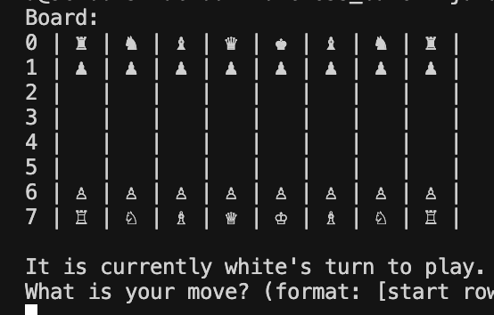
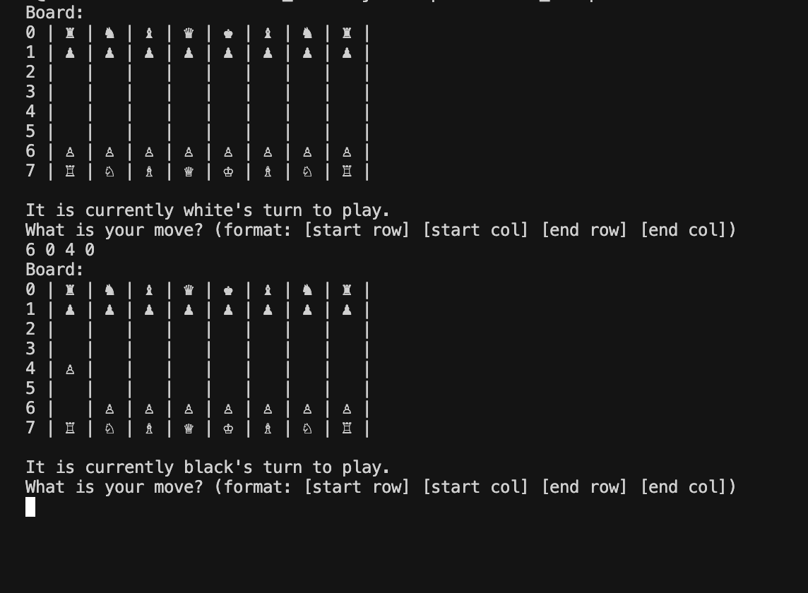

# Chess Game


A Java-based chess game featuring a complete chess engine, chess rule implementation, and a console(terminal)-based interface.

## Table of Contents
- [Overview](#overview)
- [Tech Stack](#tech-stack)
- [Directory Structure](#directory-structure)
- [Modules and Functions](#modules-and-functions)
  - [Game Logic](#game-logic)
  - [Piece Movement](#piece-movement)
  - [Board Management](#board-management)
  - [User Interface](#user-interface)
  - [File I/O](#file-io)
- [Usage](#usage)

## Overview

This is a complete chess game implementation written in Java. It includes all standard chess rules, including piece movement validation, pawn promotion, and game over detection. The game is played in the terminal using a coordinate-based system.

## Tech Stack

### Core
- **Java** — Object-oriented programming language
- **Java Collections** — Used for managing board and pieces

### Game Engine
- **Custom Piece Classes** — Pawn, Rook, Knight, Bishop, Queen, King
- **Board Management** — 2D array-based board structure
- **Movement Validation** — Rule-checking for legal moves

### User Interface
- **Console Input/Output** — Scanner-based move input, terminal rendering

### Data Management
- **FEN (Forsyth-Edwards Notation)** — Load standard/custom board states
- **File I/O (planned)** — Potential for saving/loading games

## Directory Structure

```
src/
  chess_codepack/
    Game.java           # Main game controller
    Board.java          # Chess board representation and movement logic
    Piece.java          # Abstract base class for all pieces
    Pawn.java           # Individual piece classes
    Rook.java
    Knight.java
    Bishop.java
    Queen.java
    King.java
    Fen.java            # FEN string parser for board initialization
```

## Modules and Functions

### Game Logic

**File:** `Game.java`  
- `main(String[] args)` – Starts the game loop  
- Manages turn-based logic (White and Black)  
- Handles input and validates move formats  
- Detects game over (king capture)

### Piece Movement

**File:** `Piece.java` + individual subclasses  
- Abstract base class:  
  - `isMoveLegal(Board, endRow, endCol)` – Delegates validation to subclasses  
  - `setPosition(row, col)` – Updates piece position  
  - `promote()` – Handles pawn promotion  
  - `getCharacter()` – Returns Unicode symbol

- **Piece Subclasses:**
  - `Pawn` — Move forward, diagonal capture, double first step, promotion
  - `Rook` — Vertical/horizontal with path validation
  - `Knight` — L-shaped movement (can jump over)
  - `Bishop` — Diagonal
  - `Queen` — Rook + Bishop movement
  - `King` — One square any direction

### Board Management

**File:** `Board.java`  
- 8×8 board represented with a 2D array  
- `movePiece(startRow, startCol, endRow, endCol)` — Validates and performs move  
- `isGameOver()` — Returns true if a king is captured  
- `getPiece(row, col)` / `setPiece(row, col, piece)` — Read/write board pieces  
- `toString()` — Text representation of current board

**File:** `Fen.java`  
- `load(fen, board)` — Parses FEN string and places pieces  
- Maps characters to piece objects and colors

### User Interface

**File:** `Game.java`  
- Console-based interface using `Scanner`  
- Displays board with Unicode characters  
- Prompts player input: `startRow startCol endRow endCol`  
- Handles invalid inputs and retry logic  
- Announces game result

### File I/O (Planned)

- Supports loading standard board using FEN  
- Extendable to save/load game progress

## Usage

### How to compile and start the game
```bash
javac -d out src/chess_codepack/*.java
java -cp out chess_codepack.Game
```

### Gameplay
- **Board Display:** Shows 8×8 board with chess piece symbols
- **Input Format:** `startRow startCol endRow endCol`
- **Example:** `6 0 4 0` (Moves a white pawn from a2 to a4)
- **Turn Order:** White starts, alternates per move
- **Validation:** Illegal moves are rejected with retry
- **Promotion:** Pawns promote when reaching final rank
- **Game Over:** Game ends when a king is captured


